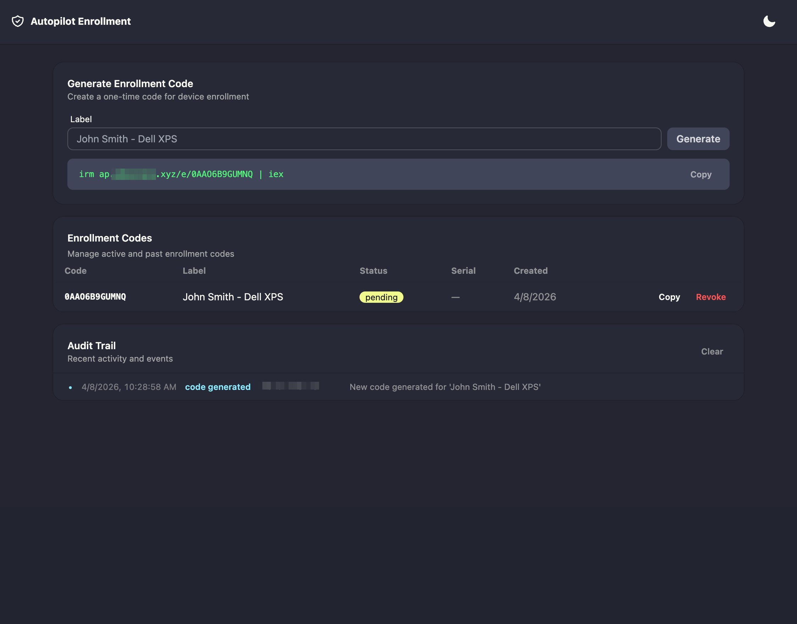
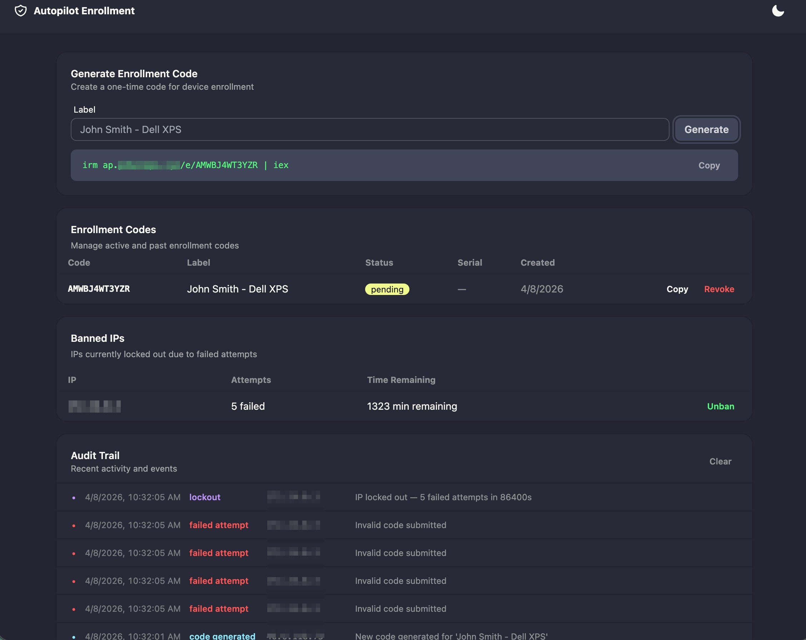
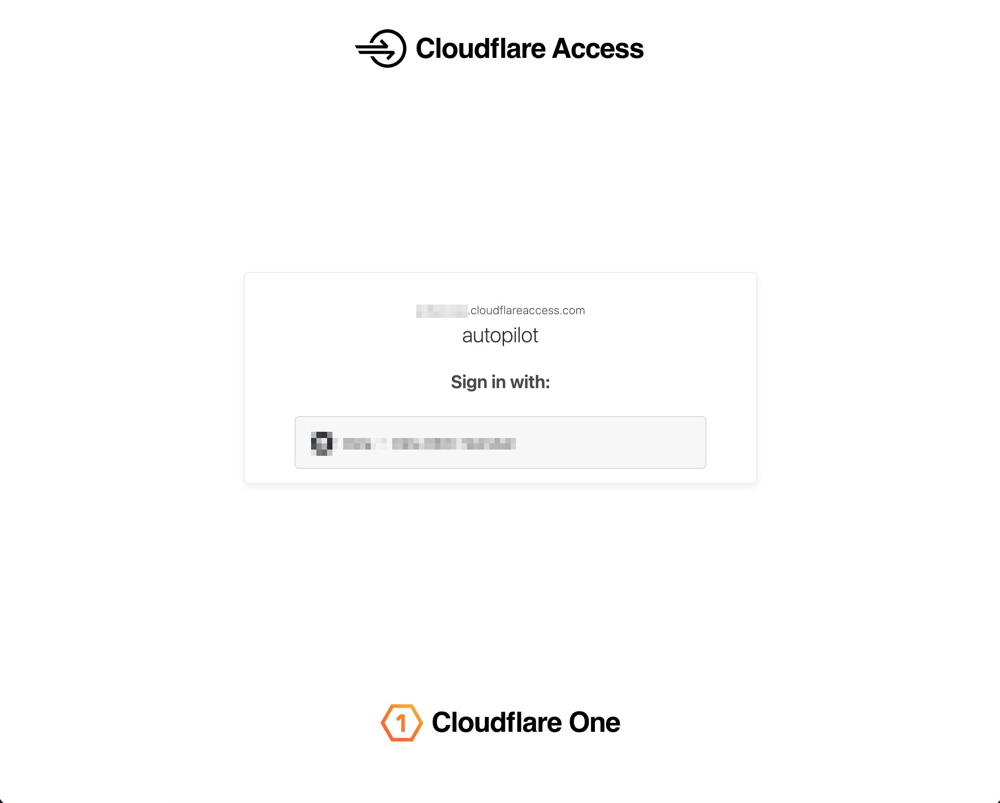

# Autopilot Enrollment Portal

> **This is a proof of concept (POC).** It is functional and security-hardened for small-scale use, but see [Production Recommendations](#production-recommendations) before deploying at scale.

A self-service portal for registering Windows devices into Microsoft Intune Autopilot. IT generates one-time enrollment codes that are included in the user's onboarding welcome email, and the device registers itself via the Microsoft Graph API.

## Prerequisites

- Docker and Docker Compose
- A Microsoft Entra ID (Azure AD) tenant
- Global Admin or Application Administrator role in your tenant

## Setup

### 1. Register the App in Microsoft Entra ID

1. Go to [Azure Portal](https://portal.azure.com) and sign in
2. Navigate to **Microsoft Entra ID** > **App registrations**
3. Click **+ New registration**
   - **Name:** `autopilot-enrollment`
   - **Supported account types:** Select **Accounts in this organizational directory only** (single tenant)
   - **Redirect URI:** Leave blank
   - Click **Register**
4. On the app's **Overview** page, copy the **Application (client) ID** -- you'll need this for `ENTRA_CLIENT_ID`
5. Copy the **Directory (tenant) ID** -- this is your `ENTRA_TENANT_ID`

### 2. Create a Client Secret

1. In your app registration, go to **Certificates & secrets**
2. Click **+ New client secret**
   - **Description:** `autopilot-enrollment-secret`
   - **Expires:** Choose an appropriate expiry (e.g. 12 months)
   - Click **Add**
3. **Immediately copy the secret Value** (not the Secret ID) -- this is your `ENTRA_CLIENT_SECRET`
   - You won't be able to see this value again after leaving the page

### 3. Grant API Permissions

1. In your app registration, go to **API permissions**
2. Click **+ Add a permission**
3. Select **Microsoft Graph**
4. Select **Application permissions** (not Delegated)
5. Search for and select: **DeviceManagementServiceConfig.ReadWrite.All**
6. Click **Add permissions**
7. Click **Grant admin consent for [your tenant]** (requires Global Admin or Privileged Role Administrator)
8. Confirm -- the status should change to **Granted**

### 4. Configure the Environment

Copy the example env file and fill in your values:

```bash
cp .env.example .env
```

```env
BACKEND_URL=https://ap.yourcompany.com

ENTRA_TENANT_ID=<your-tenant-id>
ENTRA_CLIENT_ID=<paste-application-client-id-here>
ENTRA_CLIENT_SECRET=<paste-client-secret-value-here>

TOKEN_EXPIRY_DAYS=7
AUTOPILOT_GROUP_TAG=autopilot-enrollment
SLACK_WEBHOOK_URL=https://hooks.slack.com/services/XXXXX/XXXXX/XXXXX
LOCKOUT_MAX_ATTEMPTS=5
LOCKOUT_DURATION_HOURS=24
```

- `BACKEND_URL` -- the public URL where this app is accessible (used in the PowerShell one-liner)
- `TOKEN_EXPIRY_DAYS` -- how many days an enrollment code stays valid (default: 7)
- `AUTOPILOT_GROUP_TAG` -- group tag applied to devices on import (used for dynamic group assignment in Intune)
- `SLACK_WEBHOOK_URL` -- (optional) Slack incoming webhook URL for security alerts. Leave empty to disable.
- `LOCKOUT_MAX_ATTEMPTS` -- number of failed attempts before an IP is locked out (default: 5)
- `LOCKOUT_DURATION_HOURS` -- how long a locked out IP stays banned in hours (default: 24)

### 5. Create a Dynamic Device Group in Entra ID (optional but recommended)

This automatically assigns an Autopilot deployment profile to devices registered through the portal.

1. Go to **Entra ID** > **Groups** > **New group**
2. **Group type:** Security
3. **Membership type:** Dynamic Device (requires Entra ID P1 license)
4. **Dynamic query:**
   ```
   (device.devicePhysicalIds -any (_ -contains "[OrderID]:autopilot-enrollment"))
   ```
   Replace `autopilot-enrollment` with your `AUTOPILOT_GROUP_TAG` value if you changed it.
5. In **Intune** > **Devices** > **Windows enrollment** > **Deployment profiles**, assign your Autopilot profile to this group.

Every device registered through the portal will automatically receive the assigned Autopilot profile.

### 6. Run

```bash
docker compose up --build -d
```

The portal is available at `http://localhost:8000`.

To rebuild after config changes:

```bash
docker compose down && docker compose up --build -d
```

## Usage

### IT Admin (Portal)

1. Open the portal in your browser at `/admin` (requires Cloudflare Access SSO)
2. Type a label (e.g. "John Smith - Dell XPS") and click **Generate Code**
4. Copy the one-liner and include it in the user's welcome email
5. The codes table auto-refreshes every 30 seconds showing status updates



### End User (New Device at OOBE)

1. Boot the new device
2. Select language/region
3. Press **Shift+F10** to open Command Prompt
4. Type `powershell` and press Enter
5. Type the one-liner provided by IT and press Enter — no `https://` needed, Cloudflare automatically redirects to HTTPS

> **No ethernet?** If the device is Wi-Fi only, before running the one-liner press **Shift+F10**, type `start ms-settings:network-wifi` and press Enter, connect to your network, close Settings, then continue from step 4.
7. The script installs dependencies, collects the hardware hash, and registers the device
8. The backend submits the device to Microsoft Graph and returns immediately once accepted
9. The script waits 5 minutes for Microsoft to finish processing the import, showing a countdown
10. When prompted, type **Y** to restart the device
11. On reboot, OOBE detects the device is registered in Autopilot and shows your company's enrollment flow

**Important:** The device must restart after registration for Autopilot to activate. The script will prompt for this automatically.

### Autopilot import verification

The backend submits the device to Microsoft Graph and returns immediately once Microsoft accepts the request. Microsoft processes the import asynchronously on their end, typically within a few minutes.

1. Device data is submitted to Microsoft Graph API
2. If Microsoft accepts the import, the backend returns success and the code is marked as used
3. If Microsoft rejects the import, the backend returns the error and the code remains unused (can be retried)
4. The enrollment script then waits 5 minutes locally before prompting for restart

The backend does not poll for confirmation because Cloudflare's free plan enforces a 100-second proxy timeout — Microsoft's processing typically takes 70–120 seconds, which would cause the connection to be dropped before a response is sent. Polling is handled client-side instead. Upgrading to Cloudflare Pro or above would allow increasing this timeout if server-side confirmation is needed.

**Safe to retry:** If a submission was accepted but something went wrong before the device restarted, generate a new code — the original code is marked used on successful submission. If the device was already submitted in a previous attempt, Microsoft typically recognises the duplicate hardware hash and does not create a second entry, though idempotency is not explicitly guaranteed.

### Already Installed Device

If running the script on a device that has already completed OOBE (e.g. for testing):

1. Open PowerShell **as Administrator**
2. Paste the one-liner
3. The script collects the hardware hash, registers the device, and waits for confirmation
4. When prompted, type **Y** to factory reset the device
5. On reboot, the device enters OOBE and Autopilot takes over

## API Reference

Admin endpoints are protected by Cloudflare Access SSO. Public endpoints (`/e/{code}` and `/api/e`) are open for devices to reach. 

| Endpoint | Method | Auth | Description |
|----------|--------|------|-------------|
| `/api/codes/generate` | POST | SSO | Generate a new enrollment code |
| `/api/codes` | GET | SSO | List all enrollment codes |
| `/api/codes/{code}` | DELETE | SSO | Revoke a pending code |
| `/api/e` | POST | Bearer token | Device registration (internal — called automatically by the enrollment script) |
| `/api/events` | GET | SSO | List audit trail events |
| `/api/events` | DELETE | SSO | Clear audit trail |
| `/api/bans` | GET | SSO | List currently banned IPs |
| `/api/bans/{ip}` | DELETE | SSO | Unban an IP |
| `/e/{code}` | GET | Public | Serve PowerShell enrollment script |

### Programmatic access (automation)

For scripts and CI pipelines that need to call admin endpoints without a browser, use a **Cloudflare Access Service Token**:

1. Go to **Cloudflare Zero Trust** > **Access** > **Service Auth** > **Service Tokens**
2. Click **Create Service Token**
3. Name it (e.g. `autopilot-automation`)
4. Copy the **Client ID** and **Client Secret** — you won't see the secret again
5. Go to **Access** > **Applications** > open your autopilot application > **Policies**
6. Click **Add a policy**:
   - **Policy name:** `Service Token`
   - **Action:** Service Auth
   - **Include rule:** Service Token — select `autopilot-automation`
7. Save the policy

All admin endpoint calls must include the service token headers:

```bash
-H "CF-Access-Client-Id: your-client-id" \
-H "CF-Access-Client-Secret: your-client-secret"
```

Cloudflare validates the token at the edge — no changes needed in the app.

### Generate a code

```bash
curl -X POST https://ap.yourcompany.com/api/codes/generate \
  -H "CF-Access-Client-Id: your-client-id" \
  -H "CF-Access-Client-Secret: your-client-secret" \
  -H "Content-Type: application/json" \
  -d '{"label": "John Smith - Dell XPS"}'
```

Response:
```json
{
  "code": "SZ0XO9VF1O1H",
  "oneliner": "irm ap.yourcompany.com/e/SZ0XO9VF1O1H | iex",
  "expires_at": "2026-04-14T15:48:00.046164"
}
```

### List all codes

```bash
curl https://ap.yourcompany.com/api/codes \
  -H "CF-Access-Client-Id: your-client-id" \
  -H "CF-Access-Client-Secret: your-client-secret"
```

Response:
```json
[
  {
    "code": "SZ0XO9VF1O1H",
    "label": "John Smith - Dell XPS",
    "status": "pending",
    "serial": null,
    "model": null,
    "created_at": "2026-04-07T15:48:00.046164",
    "expires_at": "2026-04-14T15:48:00.046164",
    "used_at": null
  }
]
```

Status values: `pending` (active, unused), `used` (device registered), `expired` (past expiry date).

### Revoke a code

```bash
curl -X DELETE https://ap.yourcompany.com/api/codes/SZ0XO9VF1O1H \
  -H "CF-Access-Client-Id: your-client-id" \
  -H "CF-Access-Client-Secret: your-client-secret"
```

Response:
```json
{"ok": true}
```

### Download enrollment script (public)

```bash
curl https://ap.yourcompany.com/e/SZ0XO9VF1O1H
```

Returns the PowerShell script as `text/plain`. Returns `404` for any invalid request (not found, used, or expired) — no distinction is made intentionally to avoid leaking code state.

### List audit trail events

```bash
curl https://ap.yourcompany.com/api/events \
  -H "CF-Access-Client-Id: your-client-id" \
  -H "CF-Access-Client-Secret: your-client-secret"
```

Response:
```json
[
  {
    "time": "2026-04-07T22:50:27.000000",
    "type": "failed_attempt",
    "ip": "213.195.83.230",
    "detail": "Invalid code submitted"
  }
]
```

Event types: `failed_attempt`, `rate_limit`, `lockout`, `registration`, `registration_failed`, `code_generated`, `code_revoked`, `unban`.

### Clear audit trail

```bash
curl -X DELETE https://ap.yourcompany.com/api/events \
  -H "CF-Access-Client-Id: your-client-id" \
  -H "CF-Access-Client-Secret: your-client-secret"
```

Response:
```json
{"ok": true}
```

## Security

### Admin endpoints (`/api/codes/*`)

Protected by Cloudflare Access SSO. Only authenticated users who pass the SSO challenge can reach the admin UI and API endpoints.

### Public endpoints (`/e/{code}`, `/api/e`)

These must remain open for devices to reach them, but are hardened with multiple layers:

- **Rate limiting** -- two layers: nginx enforces 2 requests/min per IP (with burst of 1, meaning max 2 requests at once then 1 every 30 seconds), and the application enforces 10 requests/min per IP as a fallback. A legitimate user only needs 1 request to download the script and 1 to register — 2/min is generous for real use while tight against scanners. Uses the `cf-connecting-ip` header behind Cloudflare so attackers can't hide behind proxies. Exceeding either limit returns `429 Too Many Requests`.
- **Failed attempt lockout** -- configurable via `LOCKOUT_MAX_ATTEMPTS` (default: 5) and `LOCKOUT_DURATION_HOURS` (default: 24). After the max attempts, the IP is locked out for the configured duration. Legitimate users copy-paste codes from the portal and never hit this. Brute-force scanners will. Banned IPs can be manually unbanned from the admin UI or via `DELETE /api/bans/{ip}`.


- **Input validation** -- codes must be exactly 12 alphanumeric characters. Malformed requests are rejected before touching the database and count as failed attempts.
- **Cryptographic code generation** -- codes are generated using Python's `secrets` module (OS-level cryptographic randomness). Unlike `random`, the output is unpredictable even if an attacker observes previously generated codes.
- **Code entropy** -- 12-character codes from a 36-character alphabet (A-Z, 0-9) give ~4.7 x 10^18 possible combinations. At 10 attempts per minute, brute-forcing would take ~900 billion years.
- **One-time use** -- codes are marked as used after a successful registration. Replaying the same code returns `410 Gone`.
- **Expiry** -- codes expire after a configurable number of days (default: 7). Expired codes cannot be used.
- **Logging** -- all failed attempts, rate limit hits, and lockouts are logged with the client IP for monitoring.
- **No information leakage** -- all invalid requests return the same generic `"Code not found"` response regardless of whether the code is too short, too long, contains invalid characters, doesn't exist, has already been used, or has expired. An attacker cannot distinguish between a wrong guess and a valid-but-consumed code. Locked-out IPs receive `"Too many failed attempts"` with no additional detail.

### SQL injection

Not possible. SQLAlchemy uses parameterised queries — all user input goes through bound parameters, never raw SQL strings. The ORM handles escaping automatically. Additionally, codes are validated as exactly 12 alphanumeric characters before they ever touch the database.

### Lockout persistence

The active ban list is stored in SQLite (`failed_attempts` table) and survives container restarts. Bans persist until they naturally expire (after `LOCKOUT_DURATION_HOURS`) or are manually cleared via the admin UI. The only in-memory state is the short-lived rate limit counter (`10 req/min` sliding window), which resets on restart — this is acceptable since it only affects burst limiting, not lockouts.

### PowerShell script security

The enrollment script (`enroll.ps1.j2`) is designed to leave minimal traces on the device:

- **In-memory execution** -- `irm ... | iex` downloads and executes the script directly in memory. No `.ps1` file is written to disk.
- **Temp file cleanup** -- the hardware hash CSV (`$env:TEMP\hash.csv`) is deleted after use, whether the registration succeeds or fails.
- **History cleanup** -- PowerShell command history is cleared so the one-liner (which contains the enrollment code and backend URL) is not persisted.
- **Installed dependencies** -- NuGet provider and `Get-WindowsAutoPilotInfo` are installed during execution and remain on the device. At OOBE this is irrelevant since the device will be reset/rebooted.

### Nginx reverse proxy (built-in)

An nginx reverse proxy is included in the Docker Compose stack. It sits in front of the FastAPI app and provides:

- **Rate limiting** on public endpoints (`/e/*`, `/api/e`): 2 requests/min per IP with burst of 1
- **Rate limiting** on admin endpoints (`/admin`, `/api/codes/*`): 30 requests/min per IP with burst of 10
- **User agent blocking** for known scanners (sqlmap, nikto, nmap, masscan, zgrab, python-requests)
- The FastAPI app is not directly exposed — only nginx listens on port 8000

### Cloudflare setup

#### 1. Cloudflare Tunnel

Expose the app to the internet without opening ports on your server.

1. Go to **Cloudflare Zero Trust** > **Networks** > **Tunnels**
2. Click **Create a tunnel** > select **Cloudflared**
3. Name it (e.g. `autopilot-enrollment`)
4. Install and run the connector on your server following the instructions shown
5. Add a **public hostname**:
   - **Subdomain:** `ap`
   - **Domain:** your domain (e.g. `yourcompany.com`)
   - **Service:** `http://localhost:8000`
6. Save — your app is now accessible at `https://autopilot.yourdomain.com`

#### 2. Cloudflare Access (SSO for admin UI)

Protect the admin UI and API endpoints with SSO so only authorised users can access them.

1. Go to **Cloudflare Zero Trust** > **Access** > **Applications**
2. Click **Add an application** > **Self-hosted**
3. Configure with four public hostnames, all on the same subdomain/domain:
   - **Path:** `admin` (the admin UI)
   - **Path:** `api/codes` (code management API)
   - **Path:** `api/events` (audit trail API)
   - **Path:** `api/bans` (banned IPs management API)
4. Under **Access policies**, create a policy:
   - **Policy name:** `Allow IT`
   - **Action:** Allow
   - **Include:** Emails ending in `@yourdomain.com` (or specific email addresses)
5. Under **Login methods**, add **Google** (or any identity provider):
   - Go to **Settings** > **Authentication** > **Login methods** > **Add new** > **Google**
   - Follow the setup to create OAuth credentials in Google Cloud Console
   - Add the Client ID and Client Secret
6. Save the application

Users accessing `/admin` will be redirected to Google SSO. Devices hitting `/e/*` and `/api/e` bypass Access entirely.



#### 3. Additional Cloudflare settings

- **Under Attack Mode** (free) -- emergency toggle under **Security** > **Quick Actions**. Shows a JS challenge to all visitors. Use during active attacks.
- **SSL/TLS** -- set to **Full** under **SSL/TLS** > **Overview** (the tunnel handles encryption between Cloudflare and your server)
- (Pro plan and above) **Bot Fight Mode** -- blocks automated scanners under **Security** > **Bots**
- (Pro plan and above) **WAF rate limiting rule** -- match `/e` and `/api/e`, limit to 5 req/min per IP, block for 10 minutes

On the free plan, the built-in nginx rate limiting and app-level lockout provide equivalent protection to the paid WAF features.

### Slack alerts

When `SLACK_WEBHOOK_URL` is configured, the app sends real-time alerts to Slack for audit trail events. Alerts are throttled to avoid spam.

| Event | Slack behaviour |
|---|---|
| Failed attempt (invalid code) | First alert per IP, then silent for 5 minutes |
| Rate limit hit | First alert per IP, then silent for 5 minutes |
| Lockout (5 failed attempts) | First alert per IP, then silent for 5 minutes |
| Device registration | Always alerts |
| Code generated | Always alerts |

All events are visible in the admin UI's **Audit Trail** panel regardless of Slack throttling.

To set up Slack webhooks: Slack > Settings > Manage apps > Incoming Webhooks > Create new webhook > copy the URL into `SLACK_WEBHOOK_URL` in `.env`.

### Defense in depth

Traffic passes through three layers before reaching the application:

1. **Cloudflare** (edge) -- DDoS protection, bot fight mode, Access SSO for `/admin`
2. **Nginx** (reverse proxy) -- rate limiting, user agent blocking
3. **Application** (Python) -- failed attempt lockout, input validation, cryptographic code entropy

## Smoke Testing

Run a quick rate limiting and lockout test against your deployment:

```bash
# Test rate limiting (expect 404s then 429s)
for i in $(seq 1 8); do
  echo "Request $i: $(curl -s -o /dev/null -w '%{http_code}' https://ap.yourcompany.com/e/SMOKETEST123)"
done
```

Expected results:
- First 2 requests: `404` (invalid code, passed through nginx burst allowance — rate=2r/m burst=1)
- Remaining requests: `429` (blocked by nginx rate limit)
- After 5 failed attempts reaching the app: IP locked out for 24 hours
- Slack: one failed attempt alert + one lockout alert (throttled)
- Admin UI: all events visible in Audit Trail panel

To reset the lockout during testing, unban the IP via the admin UI or delete the `failed_attempts` rows from the database — bans are persisted in SQLite and survive restarts. Only the in-memory rate limit counter resets on restart.

### Testing from a VM

For local testing, you can swap the URL in the one-liner to point at the Docker host IP instead of the production URL:

```powershell
irm http://192.168.1.100:8000/e/XXXXXXXXXXXX | iex
```

The enrollment code is what matters — just replace the URL when pasting into the VM's PowerShell. No need to change `BACKEND_URL` or rebuild.

## Production Recommendations

This POC uses `.env` files for configuration, SQLite for storage, and runs as a single container. For a production deployment, consider the following:

### Secrets management

The `.env` file contains sensitive credentials (Entra client secret, Slack webhook URL) stored as plain text on disk. For production:

- **AWS** -- use AWS Secrets Manager or SSM Parameter Store, and retrieve secrets at runtime via the AWS SDK
- **Azure** -- use Azure Key Vault with managed identity
- **HashiCorp Vault** -- self-hosted secrets management
- **Docker Swarm / Kubernetes** -- use native secrets (Docker secrets, Kubernetes Secrets / External Secrets Operator)

Never commit `.env` to version control. The `.gitignore` already excludes it.

### Database

SQLite is sufficient for low-volume use (a few codes per day). For higher availability:

- Use **PostgreSQL** in a separate container or a managed service (AWS RDS, Azure Database, Supabase)
- Implement regular backups -- the data in this app is not critical (Intune is the source of truth for enrolled devices), but code history and audit trail events are useful for auditing

### Hosting

- Run behind a reverse proxy with TLS termination (handled by Cloudflare Tunnel in this setup)
- Consider container orchestration (Docker Swarm, Kubernetes) for automatic restarts and health checks


## Project Structure

```
autopilot-enrollment/
├── main.py              # FastAPI app with all endpoints
├── database.py          # SQLAlchemy model + SQLite setup
├── graph.py             # Microsoft Graph API integration via MSAL
├── nginx.conf           # Nginx reverse proxy configuration
├── static/
│   └── index.html       # Frontend UI (served at /admin)
├── templates/
│   └── enroll.ps1.j2    # PowerShell enrollment script template
├── data/
│   └── enrollment.db    # SQLite database (created at runtime)
├── .env                 # Configuration (not committed)
├── .env.example         # Example configuration template
├── .gitignore
├── Dockerfile
├── docker-compose.yml
└── requirements.txt
```
